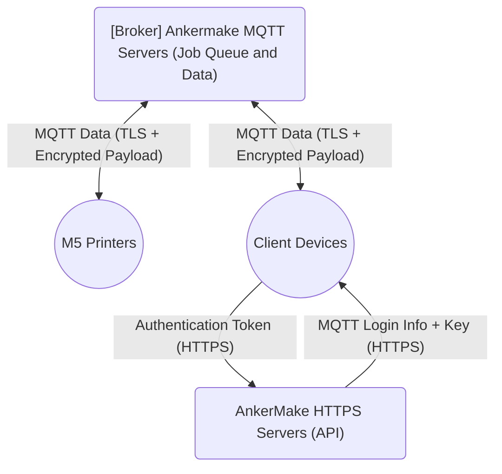

# AnkerMake MQTT Communications Overview

We're going over the the [MQTT communications standard](https://mqtt.org/) used by AnkerMake. While we won't be explaining the MQTT standard itself in much detail, we will explain certain aspects of how the protocol works for ease of understanding.

## Generic MQTT Basics

MQTT (Messaging Queue Transport Telemetry) is a lightweight and low bandwidth communications protocol primarily used by [IoT devices](https://en.wikipedia.org/wiki/Internet_of_things).

The two actors in this type of network are a **Broker** and a **Client**.  MQTT uses a publish/subscribe model to pass data and commands between clients facilitated by a broker. In order to organize where data and commands are supposed to go, the Broker organizes a hierarchy of **Topics**. 

A Topic is simply a namespace that clients can subscribe and/or publish to. 

> For example, consider modern chat/messaging applications such as iMessage and Discord. Most of these applications have implemented a feature that shows all the participants of a chat that another participant is typing a response. The topic for this feature may look something like `chat-app/conversation/participant-a/is-typing` and have a boolean value set to "false" by default. 
>
> When Participant A starts to type in the compose field, their client would publish an update to this topic that sets the value to "true". Each participant would have a corresponding topic that represents that they are typing and the other participant's clients would be subscribed to these topics. When the value of these topics changes to "true", each participant's client would present an animation to communicate this to the user.

The Broker is responsible for forwarding messages sent by the originating client to other subscribed clients. Messages are sent over a transport connection between the Client and the Broker. This connection can be unencrypted or use TLS encryption, and will always be initiated from the Client side.

The Clients have the ability to subscribe to Topics in the Broker's directory to pull down any published updates from that point forward. They also have the ability to publish updates to any Topic the Broker gives them access to. 

The messages consists of two core parts: the Topic and the **Payload**. The Payload can be anything from a single byte to a JSON file. What exactly is in the Payload is determined by the application.

> Here's an example of a simple MQTT connection that consists of two Clients (Client A and Client B), a Broker, and a single Topic of "network/application/clientA/parameter". 
>
> This example depicts a simple remote monitoring scenario for a parameter where Client A acts as a publisher and Client be acts as a subscriber.
>
> ```mermaid
> graph
>     A("[Broker] Topic: network/application/clientA/parameter") <-- "Publish: network/application/clientA/parameter" --> B(("Client A"))
>     A <-- "Subscribe: network/application/clientA/parameter" --> C(("Client B"))
> 
> ```
>


## M5 Specifics

### MQTT Deployment

AnkerMake has likely deployed MQTT via [EMQX](https://www.emqx.com/en) (most likely it's [EMQX Cloud](https://www.emqx.com/en/cloud) since the servers are hosted by [AWS](https://aws.amazon.com/)). You can infer this by typing the following command into a terminal:

```
nslookup make-mqtt.ankermake.com
```

That returns something similar to:

```
Non-authoritative answer:
Name:    ankermake-emqx-nlb-60dd062d3b52769a.elb.us-east-2.amazonaws.com
Addresses:  3.22.247.85
          3.134.119.140
          18.189.81.10
Aliases:  make-mqtt.ankermake.com
```

Look at the the `Name:` field. The hostname suggests it's an EMQX instance (but this is unconfirmed) running on an AWS server.

### Update Behavior

As long as a M5 is powered on, it publishes updates to the broker servers under the `/phone/maker/YOUR_SERIAL_NUMBER_HERE/notice` topic. It only publishes an update when a value changes.

The M5 also subscribes to other topics, where it will react to events, and treat them as commands to perform various actions. In this way, the M5 can be partially remote-controlled over MQTT.

Another client device (your phone or computer) subscribes to topics associated with the target printer and can publish commands for execution on the target printer.

The messages are exchanged via an encrypted tunnel (TLS) per the MQTT specification. What's unusual about AnkerMake MQTT messages, is that part of the payload is also encrypted before transmission using standard AES-256-CBC. In order for the communications to be successful, the messages must be encrypted and decrypted at either end. The AES encryption of the payload is required for any program interfacing with an M5 to function.

In order to encrypt and decrypt the payload, a printer-specific encryption key is required. The AnkerMake HTTPS API allows a client to pull down the MQTT login info and MQTT-only encryption key needed to setup a new client device connection instance and handle payload encryption. 

Your **Authentication Token** (auth_token) is needed to authenticate a client's identity with the AnkerMake HTTPS servers. Then those MQTT credentials are presented to the MQTT server to subscribe/publish to the topics in the broker. Finally the MQTT-only key is used to decrypt incoming messages and encrypt outgoing messages.

The basic relationships for AnkerMake MQTT communications can be illustrated as such:



### Payload Structure

As detailed in the previous section, part of the payload is encrypted. The payload is split into two parts: an unencrypted header and an encrypted JSON body. A MQTT-only key is used to decrypt incoming messages and encrypt outgoing messages using AES-256-CBC. This parsing and cryptography can be accomplished in your programs by using the `libflagship` library in this repository.

In the `specifications` folder, you'll find a file named `mqtt.stf` that maps out the contents of the message payload.
