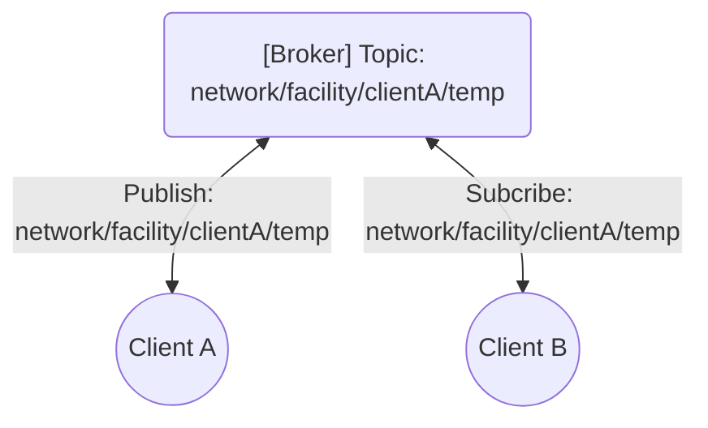
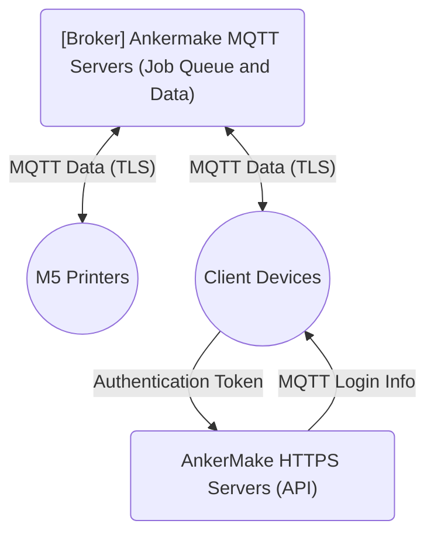

# AnkerMake MQTT Communications Overview

We're going over the AnkerMake implementation of the [MQTT communications standard](https://mqtt.org/). While we won't be explaining the MQTT standard itself, we will explain certain aspects of how the protocol works for ease of understanding.

## Generic MQTT Basics

MQTT (Messaging Que Transport Telemetry) is a [stateful](https://byjus.com/gate/difference-between-stateless-and-stateful-protocol/#:~:text=What%20is%20a%20Stateful%20Protocol,Protocol%20(FTP)%2C%20etc.), [edge driven](https://en.wikipedia.org/wiki/Edge_computing), lightweight, and low bandwidth communications protocol primarily used by [IoT devices](https://en.wikipedia.org/wiki/Internet_of_things). It was specifically designed for industry, so that's the context in which we'll lay out our brief explanation.

The two actors in this type of network are a **Broker** and a **Client**.  MQTT uses a publish/subscribe model to pass data and commands between clients facilitated by a broker. In order to organize where data and commands are supposed to go, the Broker organizes a hierarchy of **Topics**. 

A Topic is simply a namespace that clients can subscribe and/or publish to. It can describe almost any level of abstraction in your network hierarchy, but always ends at a single client device parameter at the lowest level.

The Broker responsible for receiving client-initiated connections and forwarding messages sent by the client to some other eligible clients.

The Clients have the ability to subscribe to Topics in the Broker's directory to pull down any published updates (data or commands) from that point forward. They also have the ability to publish updates to any Topic the Broker gives them access to. 

Clients are responsible for creating any instances of a connection to the Broker and thus the network is "edge-driven". Connections work over TCP and need only one outgoing port per connection instance for 2-way communications.

The messages consists of only two core parts: the Topic and the **Payload**. While the topic is self-explanatory, the Payload isn't really formally defined by MQTT. It can be anything from a single raw bit to a JSON file.

Here's an example of a simple MQTT connection that consists of two Clients (Client Ae and Client B), a Broker, and a single Topic of "network/facility/clientA/temp". In this example, this is a simple remote monitoring scenario for a temperature sensor where Client A acts as a publisher and Client be acts as a subscriber.



In a more complex network, there is likely many Topics per Client and the Broker will be in charge of handling thousands of topics at once. Clients can also send commands to other clients on the network via Topics to trigger a real world action, such as a heater turning on or a status light changing color.

## M5 Specifics

### MQTT Deployment

AnkerMake has deployed MQTT via [EMQX](https://www.emqx.com/en). Most likely it's [EMQX Cloud](https://www.emqx.com/en/cloud) since the servers are hosted by [AWS](https://aws.amazon.com/). We got that info via typing the following command into a terminal:

```
nslookup make-mqtt.ankermake.com
```

That returns something similar to:

```
Non-authoritative answer:
Name:    ankermake-emqx-nlb-60dd062d3b52769a.elb.us-east-2.amazonaws.com
Addresses:  3.22.247.85
          3.134.119.140
          18.189.81.10
Aliases:  make-mqtt.ankermake.com
```

As you can see in the `Name:` field, it's an EMQX instance running on an AWS server.

### Update Behavior

As long as a M5 is powered on, it publishes updates to the broker servers under the `/phone/maker/YOUR_SERIAL_NUMBER_HERE/notice` topic as a client device. The update seems to be done by exception, meaning that it only updates when a value changes.

The M5 also subscribes to  commands that may be sent to it from the MQTT servers for execution.

Another client device (your phone or computer) subscribes to topics associated with the target printer and can publish commands for execution on the target printer.

The basic relationships for MQTT communications can be illustrated as such:



We need to utilize the AnkerMake HTTPS API to pull down the MQTT login info and MQTT encryption key needed to setup a new client device connection instance. Your **Authentication Token** (auth_token) is what you need to authenticate your identity with the AnkerMake HTTPS servers. Then, we can plug in those MQTT credentials into the MQTT server to subscribe/publish to the topics in the broker.

The messages are exchanged via an encrypted tunnel (standard MQTT over TLS) but part of the payload is further encrypted using standard AES-256-CBC using a MQTT only encryption key.

### Payload Structure

In the `specifications` folder, you'll find a file named `mqtt.stf` and that's what we're using to map out the contents of the message payload. We don't know a whole lot right now about the possibilities of what you could see in these payloads, but we've managed to map some of the standard scenarios out. 

The entire payload is delivered as a series of raw bytes and we attempt to unwrap that into something useful. You can do whatever post processing to this packet you like to separate it into useful parts. In our example file, we pretty much just label the entire packet based on our best guess.

In general, there is two parts to payload structure an unencrypted prefix and an encrypted body. You'll have to separate the prefix from the body, decrypt the body, and then put them back together upon receiving each message. A similar process has to take place on the outbound messages as well.